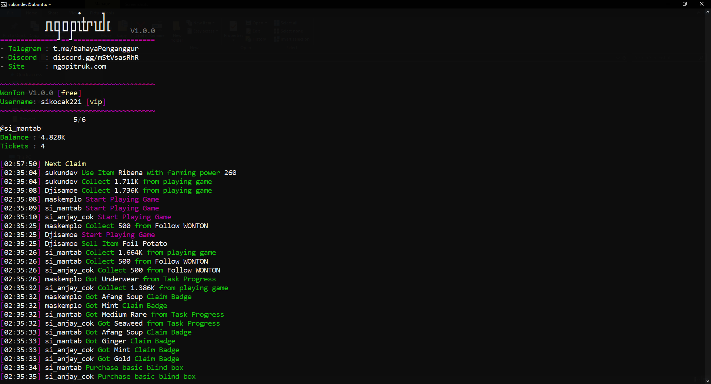

# WonTon Bot



## Installations Tools

### Windows

```bash
curl -L https://github.com/pakdechan/ngopitruk/raw/refs/heads/main/V1.0.0/ngopitruk-win-x64.exe > ngopitruk.exe

ngopitruk.exe help
ngopitruk.exe login
```

### Linux x64

```bash
curl -L https://github.com/pakdechan/ngopitruk/raw/refs/heads/main/V1.0.0/ngopitruk-linux-x64 > ngopitruk

chmod +x ngopitruk

./ngopitruk help
./ngopitruk login
```

### Linux arm64

```bash
curl -L https://github.com/pakdechan/ngopitruk/raw/refs/heads/main/V1.0.0/ngopitruk-linux-arm64 > ngopitruk

chmod +x ngopitruk

./ngopitruk help
./ngopitruk login
```

## Usage

`Install scripts`

```bash
./ngopitruk install wonton
```

`Run Sripts`

```bash
./ngopitruk run wonton
```

## Social Media

<div align="left">
  <a href="https://www.youtube.com/@pakdeKun32" target="_blank">
    
  </a>
  <a href="https://www.instagram.com/pakdekun32" target="_blank">
    
  </a>
  <a href="https://www.tiktok.com/@pakdekun" target="_blank">
    
  </a>
  <a href="https://t.me/bahayaPenganggur" target="_blank">
    
  </a>
  <a href="https://discord.gg/mStVsasRhR" target="_blank">
    
  </a>
</div>

## Dontaion

<div style="display: flex; align-items: center; gap: 10px; margin: 10px 0;">
  <a 
    href="https://saweria.co/PakdeKun" 
    target="_blank" 
    style="
      display: flex; 
      align-items: center; 
      text-decoration: none; 
      color: #333; 
      background: #f7f7f7; 
      border: 1px solid #ccc; 
      border-radius: 8px; 
      padding: 8px 12px; 
      box-shadow: 0 4px 6px rgba(0, 0, 0, 0.1); 
      transition: all 0.3s ease;
    "
  >
    
    <span style="font-weight: bold; font-size: 16px;">Saweria</span>
  </a>
</div>

## Official Website

Visit the official website for more information and updates: https://www.ngopitruk.com
